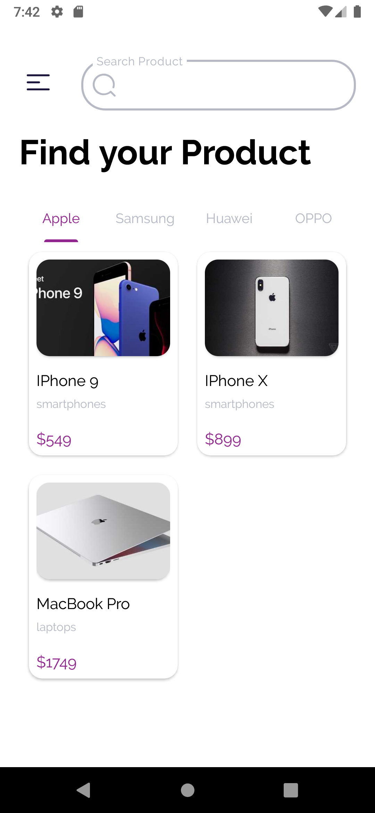
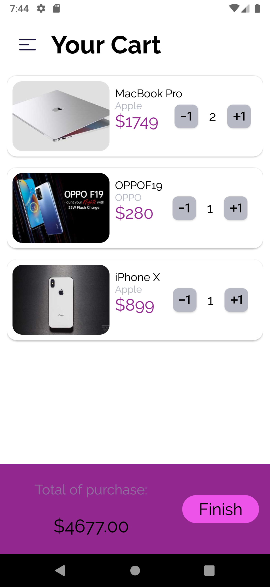

# TechMarket

Aplicativo feito em Java que usa da <a href= "https://dummyjson.com/">DummyJsonApi</a> para
obter informações sobre alguns produtos.

## Features do app:

<ul>
  <li> Lista os produtos filtrado por marca  
    
    
  <li> Pesquisa de produtos
  <li> Exibe os detalhes do produto ao clicar nele  
    
  <li> Pesquisa e mostra informações sobre as linhas
  <li> Adiciona o produto na WishList ao clicar no coração na tela de detalhes
  <li> Remove o produto da WishList ao clicar novamente no coração
  <li> Lista os produtos que foram adicionado na wish list e permite pesquisa-los  
    
  <li> Adiciona o produto ao carrinho clicando no botão na parte inferior da tela de detalhes
  <li> Lista os produtos que foram adicionados ao carrinhos  
    
  <li> Permite aumentar ou diminuir a quantidade de itens do mesmo produto e atualiza o valor total
    
</ul>

## Bibliotecas usadas

<ul>
  <li> Retrofit2
  <li> Navigation
  <li> RecyclerView
  <li> Glide
</ul>

E alem das bibliotecas o aplicativo usa MVVM

      

